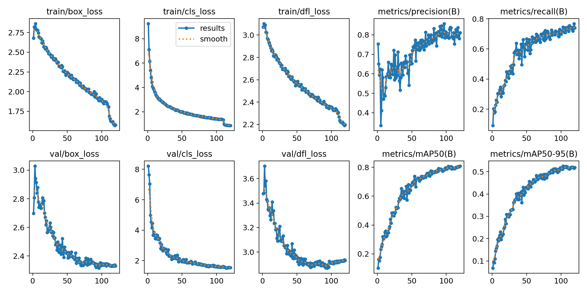
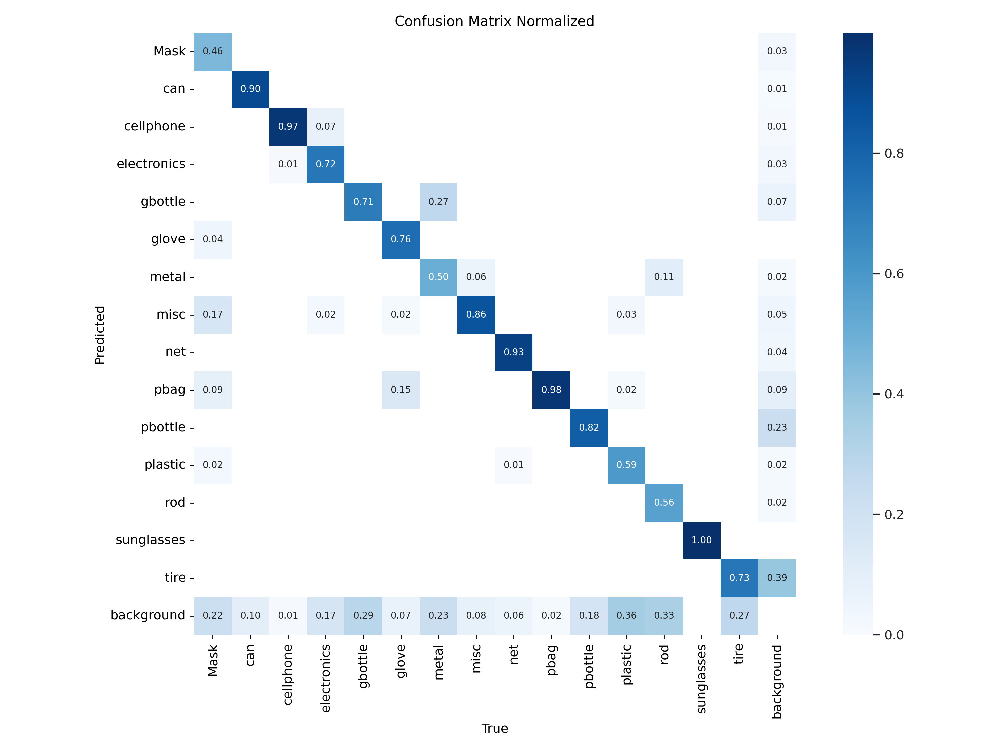
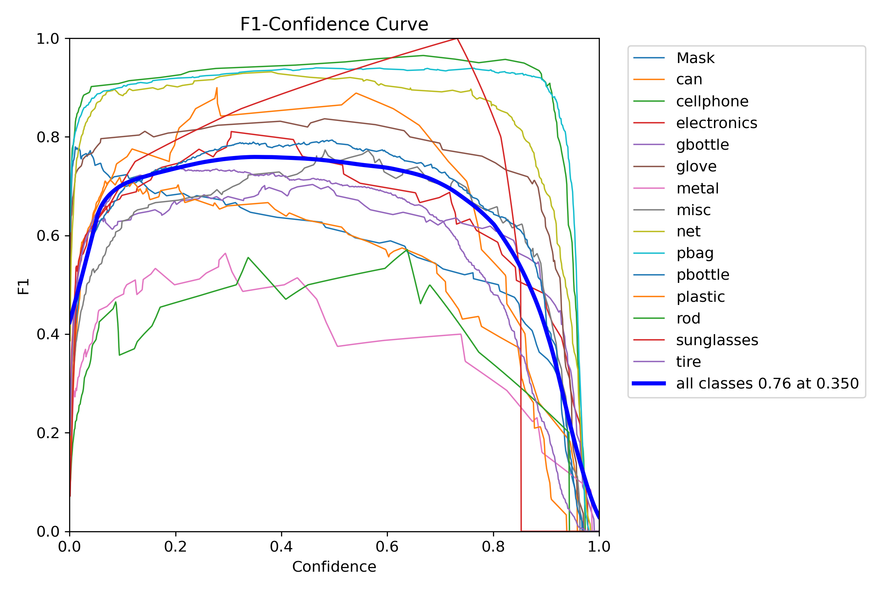
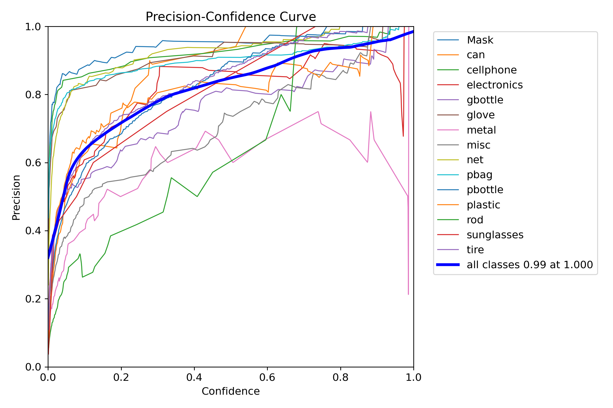
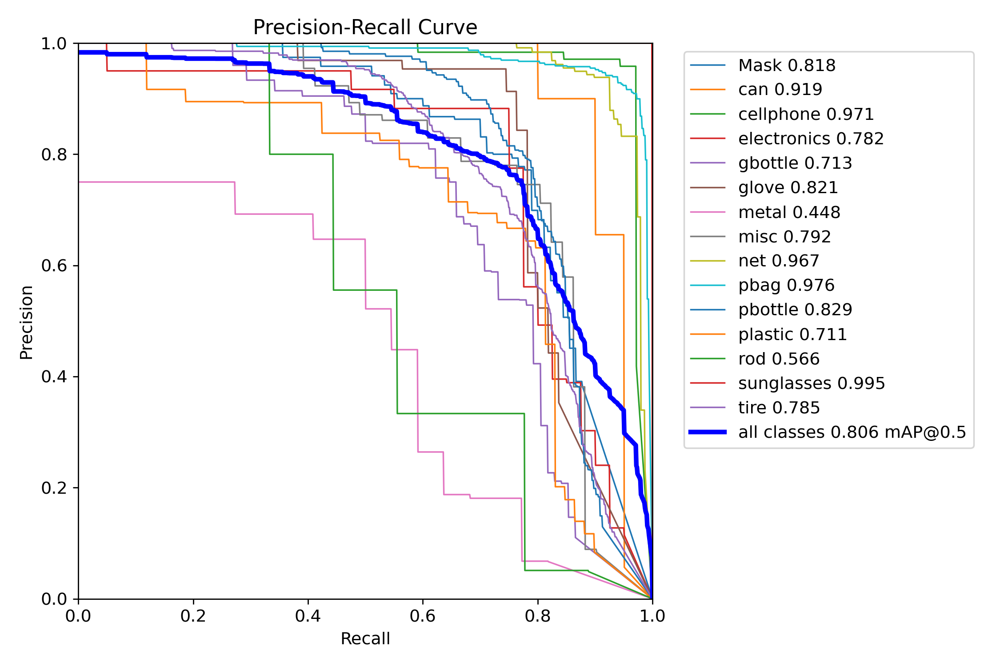

Check out the configuration reference at https://huggingface.co/docs/hub/spaces-config-reference

### 📈 Model Performance Visualizations

These visualizations summarize the training and evaluation of our YOLOv10 model on a custom ocean trash dataset.

- **Training Metrics**: Tracks loss and performance over 120 training epochs.
- **Confusion Matrix**: Shows how well the model distinguishes among 16 garbage categories.
- **F1 / Precision / PR Curves**: Evaluate how confident and accurate the model is across classes.

📊 These help researchers assess strengths, weaknesses, and opportunities for improvement.

